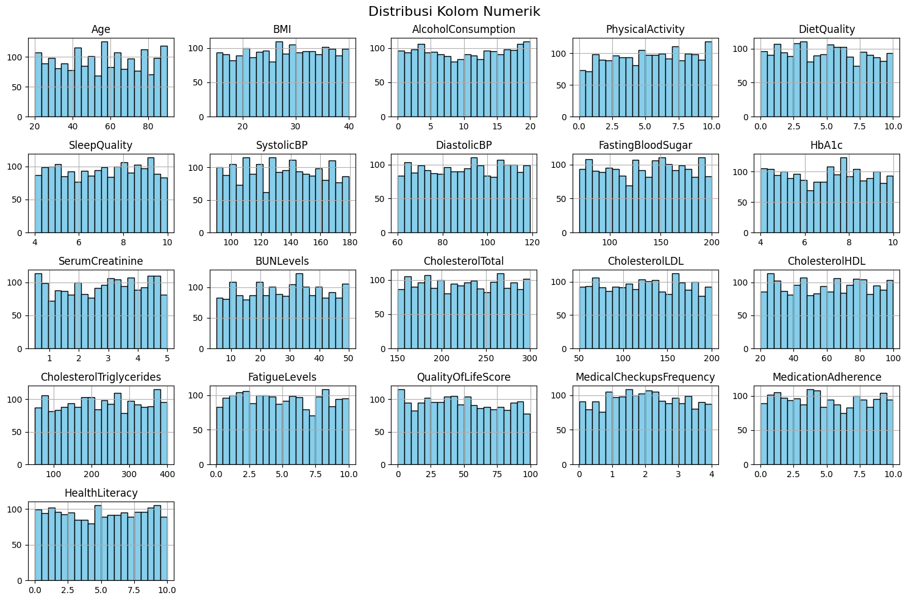
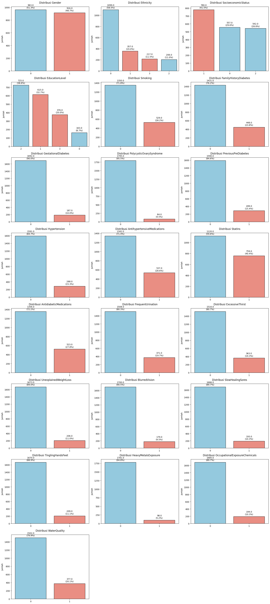
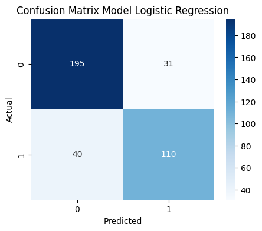
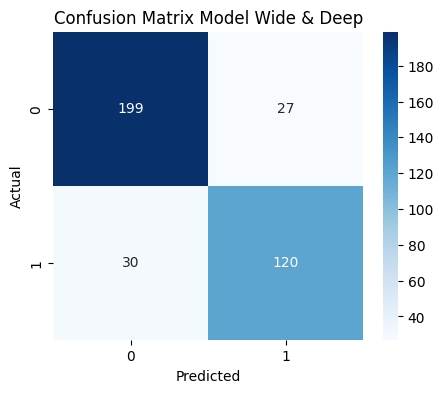

# Sistem Analisis Prediksi Diabetes

## Domain Proyek

Diabetes adalah penyakit kronis yang terus meningkat jumlahnya secara global. Gejalanya sering tidak terasa pada tahap awal, sehingga banyak kasus baru terdeteksi setelah muncul komplikasi serius. Padahal, deteksi dini sangat penting untuk mencegah perkembangan penyakit dan mengurangi risiko jangka panjang.

Namun, tidak semua orang memiliki akses terhadap pemeriksaan medis rutin. Faktor-faktor seperti gaya hidup, riwayat keluarga, atau gejala ringan sering diabaikan, meskipun dapat menjadi indikator awal diabetes. Di sinilah teknologi kecerdasan buatan (AI) dan machine learning berperan penting dalam menyediakan solusi skrining awal yang cepat dan berbasis data.
NutriAI hadir sebagai sistem berbasis predictive analysis yang dikembangkan untuk mendeteksi potensi diabetes menggunakan informasi kesehatan dasar, gaya hidup, dan data klinis sederhana. Sistem ini mengandalkan tiga model utama—Neural Network, Logistic Regression, dan Wide & Deep—untuk memberikan prediksi yang akurat.

Selain prediksi, NutriAI juga dilengkapi modul rekomendasi berbasis clustering, yang membandingkan kondisi pengguna dengan kelompok non-diabetes untuk memberikan saran perbaikan yang lebih personal. Dengan pendekatan ini, NutriAI mendukung deteksi dini sekaligus edukasi gaya hidup sehat secara praktis dan terarah.

## Business Understanding

### Problem Statements

- Bagaimana cara mendeteksi risiko diabetes secara dini menggunakan data kesehatan dasar, gaya hidup, dan klinis tanpa perlu tes laboratorium lanjutan?
- Bagaimana memberikan rekomendasi personal berbasis data untuk membantu pengguna mengurangi risiko diabetes?

### Goals

- Mengembangkan sistem prediksi diabetes berbasis machine learning dengan akurasi tinggi menggunakan data input pasien yang mudah diperoleh.
- Mengembangkan sistem rekomendasi yang membandingkan data pengguna dengan profil non-diabetes untuk memberikan saran perbaikan yang relevan.

### Solution statements

- Membangun model Neural Network, Logistic Regression, dan Wide & Deep sebagai baseline model.

## Data Understanding

Dataset yang digunakan dalam project ini : [🩸Diabetes Health Dataset Analysis🩸](https://www.kaggle.com/datasets/rabieelkharoua/diabetes-health-dataset-analysis)

Dataset ini berisi rekam medis pasien yang terkait dengan diagnosis penyakit jantung.

### EDA

#### Variabel-variabel pada Diabetes Health Dataset Analysis :

| Kategori                       | Nama Fitur                    | Deskripsi                                                       |
| ------------------------------ | ----------------------------- | --------------------------------------------------------------- |
| ID Pasien                      | PatientID                     | Pengenal unik pasien (6000–7878)                                |
| Detail Demografis              | Age                           | Usia pasien (20–90 tahun)                                       |
|                                | Gender                        | Jenis kelamin (0: Laki-laki, 1: Perempuan)                      |
|                                | Ethnicity                     | Etnisitas (0: Kaukasia, 1: Afrika-Amerika, 2: Asia, 3: Lainnya) |
|                                | SocioeconomicStatus           | Status sosial ekonomi (0: Rendah, 1: Menengah, 2: Tinggi)       |
|                                | EducationLevel                | Tingkat pendidikan (0–3)                                        |
| Faktor Gaya Hidup              | BMI                           | Indeks Massa Tubuh (15–40)                                      |
|                                | Smoking                       | Merokok (0: Tidak, 1: Ya)                                       |
|                                | AlcoholConsumption            | Konsumsi alkohol mingguan (0–20)                                |
|                                | PhysicalActivity              | Aktivitas fisik mingguan (jam, 0–10)                            |
|                                | DietQuality                   | Skor kualitas diet (0–10)                                       |
|                                | SleepQuality                  | Skor kualitas tidur (4–10)                                      |
| Riwayat Medis                  | FamilyHistoryDiabetes         | Riwayat keluarga diabetes (0: Tidak, 1: Ya)                     |
|                                | GestationalDiabetes           | Diabetes gestasional (0: Tidak, 1: Ya)                          |
|                                | PolycysticOvarySyndrome       | Sindrom ovarium polikistik (0: Tidak, 1: Ya)                    |
|                                | PreviousPreDiabetes           | Riwayat pre-diabetes (0: Tidak, 1: Ya)                          |
|                                | Hypertension                  | Hipertensi (0: Tidak, 1: Ya)                                    |
| Pengukuran Klinis              | SystolicBP                    | Tekanan darah sistolik (90–180 mmHg)                            |
|                                | DiastolicBP                   | Tekanan darah diastolik (60–120 mmHg)                           |
|                                | FastingBloodSugar             | Gula darah puasa (70–200 mg/dL)                                 |
|                                | HbA1c                         | Hemoglobin A1c (4.0%–10.0%)                                     |
|                                | SerumCreatinine               | Kreatinin serum (0.5–5.0 mg/dL)                                 |
|                                | BUNLevels                     | Blood Urea Nitrogen (5–50 mg/dL)                                |
|                                | CholesterolTotal              | Kolesterol total (150–300 mg/dL)                                |
|                                | CholesterolLDL                | Kolesterol LDL (50–200 mg/dL)                                   |
|                                | CholesterolHDL                | Kolesterol HDL (20–100 mg/dL)                                   |
|                                | CholesterolTriglycerides      | Trigliserida (50–400 mg/dL)                                     |
| Penggunaan Obat-obatan         | AntihypertensiveMedications   | Obat antihipertensi (0: Tidak, 1: Ya)                           |
|                                | Statins                       | Penggunaan statin (0: Tidak, 1: Ya)                             |
|                                | AntidiabeticMedications       | Obat antidiabetes (0: Tidak, 1: Ya)                             |
| Gejala & Kualitas Hidup        | FrequentUrination             | Sering buang air kecil (0: Tidak, 1: Ya)                        |
|                                | ExcessiveThirst               | Rasa haus berlebihan (0: Tidak, 1: Ya)                          |
|                                | UnexplainedWeightLoss         | Penurunan berat badan tanpa sebab (0: Tidak, 1: Ya)             |
|                                | FatigueLevels                 | Tingkat kelelahan (0–10)                                        |
|                                | BlurredVision                 | Penglihatan kabur (0: Tidak, 1: Ya)                             |
|                                | SlowHealingSores              | Luka lambat sembuh (0: Tidak, 1: Ya)                            |
|                                | TinglingHandsFeet             | Kesemutan tangan/kaki (0: Tidak, 1: Ya)                         |
|                                | QualityOfLifeScore            | Skor kualitas hidup (0–100)                                     |
| Paparan Lingkungan & Pekerjaan | HeavyMetalsExposure           | Paparan logam berat (0: Tidak, 1: Ya)                           |
|                                | OccupationalExposureChemicals | Paparan bahan kimia kerja (0: Tidak, 1: Ya)                     |
|                                | WaterQuality                  | Kualitas air (0: Baik, 1: Buruk)                                |
| Perilaku Kesehatan             | MedicalCheckupsFrequency      | Frekuensi cek medis per tahun (0–4)                             |
|                                | MedicationAdherence           | Kepatuhan minum obat (0–10)                                     |
|                                | HealthLiteracy                | Literasi kesehatan (0–10)                                       |
| Informasi Diagnosis            | Diagnosis                     | Status diabetes (0: Tidak, 1: Ya)                               |
| Dokter Penanggung Jawab        | DoctorInCharge                | Nilai unik: "Confidential"                                      |

**Preview Data**
| PatientID | Age | Gender | Ethnicity | SocioeconomicStatus | EducationLevel | BMI | Smoking | AlcoholConsumption | PhysicalActivity | ... | TinglingHandsFeet | QualityOfLifeScore | HeavyMetalsExposure | OccupationalExposureChemicals | WaterQuality | MedicalCheckupsFrequency | MedicationAdherence | HealthLiteracy | Diagnosis | DoctorInCharge |
|-----------|-----|--------|-----------|----------------------|----------------|-----------|---------|---------------------|------------------|-----|--------------------|---------------------|----------------------|-------------------------------|---------------|--------------------------|---------------------|----------------|-----------|-----------------|
| 6000 | 44 | 0 | 1 | 2 | 1 | 32.985284 | 1 | 4.499365 | 2.443385 | ... | 1 | 73.765109 | 0 | 0 | 0 | 1.782724 | 4.486980 | 7.211349 | 1 | Confidential |
| 6001 | 51 | 1 | 0 | 1 | 2 | 39.916764 | 0 | 1.578919 | 8.301264 | ... | 0 | 91.445753 | 0 | 0 | 1 | 3.381070 | 5.961705 | 5.024612 | 1 | Confidential |
| 6002 | 89 | 1 | 0 | 1 | 3 | 19.782251 | 0 | 1.177301 | 6.103395 | ... | 0 | 54.485744 | 0 | 0 | 0 | 2.701019 | 8.950821 | 7.034944 | 0 | Confidential |
| 6003 | 21 | 1 | 1 | 1 | 2 | 32.376881 | 1 | 1.714621 | 8.645465 | ... | 0 | 77.866758 | 0 | 0 | 1 | 1.409056 | 3.124769 | 4.717774 | 0 | Confidential |
| 6004 | 27 | 1 | 0 | 1 | 3 | 16.808600 | 0 | 15.462549 | 4.629383 | ... | 0 | 37.731808 | 0 | 0 | 0 | 1.218452 | 6.977741 | 7.887940 | 0 | Confidential |

**Struktur Data**:
| No. | Kolom | Non-Null Count | Dtype |
|-----|--------------------------------|----------------|-----------|
| 0 | PatientID | 1879 | int64 |
| 1 | Age | 1879 | int64 |
| 2 | Gender | 1879 | int64 |
| 3 | Ethnicity | 1879 | int64 |
| 4 | SocioeconomicStatus | 1879 | int64 |
| 5 | EducationLevel | 1879 | int64 |
| 6 | BMI | 1879 | float64 |
| 7 | Smoking | 1879 | int64 |
| 8 | AlcoholConsumption | 1879 | float64 |
| 9 | PhysicalActivity | 1879 | float64 |
| 10 | DietQuality | 1879 | float64 |
| 11 | SleepQuality | 1879 | float64 |
| 12 | FamilyHistoryDiabetes | 1879 | int64 |
| 13 | GestationalDiabetes | 1879 | int64 |
| 14 | PolycysticOvarySyndrome | 1879 | int64 |
| 15 | PreviousPreDiabetes | 1879 | int64 |
| 16 | Hypertension | 1879 | int64 |
| 17 | SystolicBP | 1879 | int64 |
| 18 | DiastolicBP | 1879 | int64 |
| 19 | FastingBloodSugar | 1879 | float64 |
| 20 | HbA1c | 1879 | float64 |
| 21 | SerumCreatinine | 1879 | float64 |
| 22 | BUNLevels | 1879 | float64 |
| 23 | CholesterolTotal | 1879 | float64 |
| 24 | CholesterolLDL | 1879 | float64 |
| 25 | CholesterolHDL | 1879 | float64 |
| 26 | CholesterolTriglycerides | 1879 | float64 |
| 27 | AntihypertensiveMedications | 1879 | int64 |
| 28 | Statins | 1879 | int64 |
| 29 | AntidiabeticMedications | 1879 | int64 |
| 30 | FrequentUrination | 1879 | int64 |
| 31 | ExcessiveThirst | 1879 | int64 |
| 32 | UnexplainedWeightLoss | 1879 | int64 |
| 33 | FatigueLevels | 1879 | float64 |
| 34 | BlurredVision | 1879 | int64 |
| 35 | SlowHealingSores | 1879 | int64 |
| 36 | TinglingHandsFeet | 1879 | int64 |
| 37 | QualityOfLifeScore | 1879 | float64 |
| 38 | HeavyMetalsExposure | 1879 | int64 |
| 39 | OccupationalExposureChemicals | 1879 | int64 |
| 40 | WaterQuality | 1879 | int64 |
| 41 | MedicalCheckupsFrequency | 1879 | float64 |
| 42 | MedicationAdherence | 1879 | float64 |
| 43 | HealthLiteracy | 1879 | float64 |
| 44 | Diagnosis | 1879 | int64 |
| 45 | DoctorInCharge | 1879 | object |

### Visualisasi Data

```python
import numpy as np

all_numeric = df_new.select_dtypes(include=np.number).columns

numerical_features = [col for col in all_numeric if df_new[col].nunique() > 10 and col != 'Diagnosis']

categorical_numeric = [col for col in all_numeric if df_new[col].nunique() <= 10 and col != 'Diagnosis']

categorical_object = df_new.select_dtypes(include=['object', 'category']).columns.tolist()

categorical_features = categorical_numeric + categorical_object
```

Sebelum melakukan visualisasi data, fitur-fitur yang ada dikelompokkan menjadi fitur numerik kontinu (dengan jumlah nilai unik >10) dan fitur kategorikal (terdiri dari fitur numerik dengan nilai unik ≤10 serta fitur bertipe objek), guna memudahkan analisis dan pemrosesan selanjutnya.

Setelah melakukan pengelimpokkan fitur, kita akan masuk ke bagian visualisasi data. Bagian ini berfungsi untuk melakukan visualisasi terhadap fitur-fitur yang akan digunakan dalam proses modeling nantinya. Berikut Visualisasi-visualisasinya :

#### Visualisasi fitur-fitur numerik



Insight :

- **Age**: Distribusi usia cukup merata dari usia muda hingga tua, dengan sedikit dominasi pada usia 50–70 tahun. Ini mencerminkan populasi pasien dengan risiko diabetes atau penyakit metabolik yang meningkat seiring bertambahnya usia.
- **BMI**: Terdistribusi normal dengan puncak pada BMI sekitar 25–30, menunjukkan mayoritas pasien berada dalam kategori overweight atau obesitas ringan—faktor risiko prediabetes.
- **AlcoholConsumption & PhysicalActivity**: Distribusi agak merata, namun terdapat lonjakan pada nilai tertentu. Nilai rendah konsumsi alkohol dan aktivitas fisik bisa menjadi indikasi gaya hidup tidak sehat.
- **DietQuality & SleepQuality**: Menunjukkan variasi seimbang, tetapi cenderung tinggi pada skor 6–8. Ini mungkin mencerminkan kesadaran gaya hidup atau intervensi kesehatan.
- **SystolicBP & DiastolicBP**: Sebagian besar pasien memiliki tekanan darah normal hingga tinggi, sejalan dengan kecenderungan hipertensi pada penderita prediabetes/diabetes.
- **FastingBloodSugar & HbA1c**: Distribusi menyebar dengan konsentrasi pasien pada kadar gula darah tinggi. Ini konsisten dengan profil prediabetes/diabetes.
- **SerumCreatinine & BUNLevels**: Distribusi stabil dengan sedikit konsentrasi di tengah rentang, yang bisa menunjukkan penurunan fungsi ginjal ringan pada beberapa pasien.
- **Kolesterol (Total, LDL, HDL, Triglycerides)**:
  - **LDL & Triglycerides**: Banyak pasien memiliki nilai tinggi, yang meningkatkan risiko kardiovaskular.
  - **HDL**: Mayoritas berada pada level cukup, meski sedikit pasien memiliki HDL tinggi (bersifat protektif).
- **FatigueLevels**: Banyak pasien melaporkan kelelahan sedang hingga tinggi (6–10), gejala umum gula darah tidak stabil.
- **QualityOfLifeScore**: Distribusi cukup datar, dengan kecenderungan ke skor rendah. Ini menandakan gangguan pada kualitas hidup pasien.
- **MedicalCheckupsFrequency**: Banyak pasien melakukan pemeriksaan rutin (nilai 2–3), meskipun sebagian lainnya jarang memeriksakan diri.
- **MedicationAdherence & HealthLiteracy**: Nilainya cukup beragam, tetapi terdapat pasien dengan skor rendah yang menunjukkan kurangnya edukasi atau kepatuhan terhadap pengobatan.

**Kesimpulan:**  
Mayoritas pasien dalam dataset ini menunjukkan karakteristik berisiko tinggi terhadap diabetes atau prediabetes, seperti BMI dan tekanan darah tinggi, kadar gula darah tinggi, serta kelelahan. Namun, sebagian juga menunjukkan perilaku preventif seperti rutin melakukan pemeriksaan dan menjaga gaya hidup yang moderat.

#### Visualisais fitur-fitur kategorikal



Insight :

- **Gender**: Distribusi gender cukup seimbang antara laki-laki dan perempuan, menunjukkan data tidak bias terhadap jenis kelamin tertentu.
- **Ethnicity**: Mayoritas pasien berasal dari satu kelompok etnis dominan (~58%), dengan sisanya tersebar merata. Ini menunjukkan keragaman etnis yang masih terbatas.
- **SocioeconomicStatus**: Distribusi relatif merata, namun status ekonomi 1 paling dominan (~41%). Hal ini dapat mencerminkan beban penyakit yang lebih tinggi pada populasi berpenghasilan rendah.
- **EducationLevel**: Sebagian besar pasien memiliki tingkat pendidikan 1 dan 2. Pendidikan tinggi (~9%) masih jarang, yang bisa berdampak pada pemahaman dan pengelolaan kesehatan.
- **Smoking**: Sekitar 28% pasien adalah perokok. Meskipun bukan mayoritas, angka ini signifikan sebagai faktor risiko tambahan.
- **FamilyHistoryDiabetes**: Sekitar 76% pasien tidak memiliki riwayat keluarga diabetes. Sisanya memiliki potensi risiko genetik yang lebih tinggi.
- **GestationalDiabetes & PolycysticOvarySyndrome**: Kedua kondisi ini relatif jarang (masing-masing sekitar 10% dan 5%), dan relevan hanya pada subpopulasi wanita.
- **PreviousPreDiabetes**: Hanya 13.5% pasien pernah terdiagnosis prediabetes, menunjukkan masih banyak kasus yang belum terdeteksi secara klinis.
- **Hypertension**: Sebanyak 15.7% pasien memiliki hipertensi, mendukung hubungan antara tekanan darah tinggi dan risiko diabetes.
- **AntihypertensiveMedications & Statins**: Sekitar 26–40% pasien menggunakan obat antihipertensi atau statin, menunjukkan intervensi terhadap risiko kardiometabolik.
- **AntidiabeticMedications**: Sekitar 27.8% pasien sudah menggunakan obat diabetes, menandakan sebagian besar dalam tahap perawatan aktif.
- **FrequentUrination, ExcessiveThirst, FatigueLevels, TinglingHandsFeet, BlurredVision, SlowHealingSores**:
  - Gejala klasik prediabetes/diabetes ini muncul pada 10–20% pasien dan cukup signifikan untuk menjadi indikator skrining awal.
- **UnexplainedWeightLoss**: Muncul pada sekitar 11% pasien, bisa menandakan kondisi metabolik berat (misalnya diabetes tipe 1 atau kondisi dekompensasi).
- **HeavyMetalsExposure & OccupationalExposureChemicals**: Sekitar 8–10% pasien mengalami paparan, menunjukkan potensi risiko lingkungan yang meskipun kecil tetap relevan.
- **WaterQuality**: Sekitar 20% pasien mengalami masalah kualitas air, yang dapat berdampak terhadap kesehatan secara tidak langsung.

**Kesimpulan:**  
Dataset menunjukkan proporsi gejala klasik diabetes yang cukup tinggi, disertai faktor risiko signifikan seperti hipertensi, kebiasaan merokok, dan penggunaan obat-obatan metabolik. Sebagian besar pasien belum terdiagnosis prediabetes sebelumnya, namun keberadaan gejala dan faktor risiko memperkuat urgensi skrining dini. Faktor sosial-ekonomi dan pendidikan juga berkontribusi dalam distribusi risiko.

## Pre-processing Data

### Konversi Tipe Data

```python
df_encoded = pd.get_dummies(df_new, columns=['Ethnicity', 'SocioeconomicStatus'], drop_first=True, dtype=int)
```

Pada tahap ini, dilakukan konversi pada fitur **Ethnicity** dan **SocioeconomicStatus** menggunakan metode One-hot encoding untuk mengonversi kategori nominal menjadi variabel biner independen dan menghindari asumsi urutan.

### Data Splitting

```python
from sklearn.model_selection import train_test_split

X = df_encoded.drop('Diagnosis', axis=1)
y = df_encoded['Diagnosis']

X_train, X_test, y_train, y_test = train_test_split(X, y, test_size=0.2, random_state=42, stratify=y)
```

Pada tahap ini, data-data yang ada pada dataset dibagi menjadi data test dan data train dengan perbandingan 80 (train) & 20 (test) yang akan digunakan pada tahap modeling dan evaluasi.

### Normalisasi Fitur

```python
from sklearn.preprocessing import MinMaxScaler

minmax_scaler = MinMaxScaler()

X_train[numerical_features] = minmax_scaler.fit_transform(X_train[numerical_features])

X_test[numerical_features] = minmax_scaler.transform(X_test[numerical_features])

X_test[numerical_features].head()
```

Pada tahap ini, dilakukan proses normalisasi fitur numerik kontinu menggunakan **MinMaxScaler** dari scikit-learn. Pertama, scaler diinisialisasi dan kemudian di-fit serta di-transform pada data latih (**X_train[numerical_features]**) untuk mengubah skala fitur ke rentang [0, 1]. Setelah itu, data uji (**X_test[numerical_features]**) juga ditransformasikan menggunakan scaler yang sama (tanpa re-fit) untuk memastikan konsistensi skala antar data latih dan data uji, sehingga model dapat melakukan prediksi dengan akurat dan stabil.

## Modeling

### Model Neural Network

```python
from tensorflow.keras.models import Sequential
from tensorflow.keras.layers import Dense, Dropout
from tensorflow.keras.optimizers import Adam

model_neural_network = Sequential([
    Dense(128, activation='relu', input_shape=(X_train.shape[1],)),
    Dropout(0.5),
    Dense(64, activation='relu'),
    Dropout(0.3),
    Dense(32, activation='relu'),
    Dropout(0.1),
    Dense(1, activation='sigmoid')
])

model_neural_network.compile(optimizer=Adam(learning_rate=0.0008),
              loss='binary_crossentropy',
              metrics=['accuracy'])

from tensorflow.keras.callbacks import EarlyStopping

early_stop = EarlyStopping(monitor='val_loss', patience=10, restore_best_weights=True)

history_neural_network = model_neural_network.fit(X_train, y_train,
                    validation_data=(X_test, y_test),
                    epochs=100,
                    batch_size=32,
                    verbose=1,
                    callbacks=[early_stop])
```

Pada tahap ini, dibangun dan dilatih model klasifikasi Neural Network menggunakan Keras. Arsitektur model terdiri dari tiga hidden layer berukuran 128, 64, dan 32 neuron dengan fungsi aktivasi ReLU, serta layer dropout bertingkat (0.5, 0.3, dan 0.1) untuk mengurangi overfitting. Output layer menggunakan aktivasi sigmoid karena masalah yang dihadapi adalah klasifikasi biner (diabetes atau tidak). Model dikompilasi dengan optimizer Adam (learning rate 0.0008) dan binary crossentropy sebagai fungsi loss. Proses pelatihan menggunakan 100 epoch dan batch size 32, dengan **EarlyStopping** yang memantau **val_loss** dan menghentikan pelatihan jika tidak ada perbaikan dalam 10 epoch untuk menjaga performa terbaik model.

### Model Logistic Regression

```python
model_logistic_regression = Sequential([
    Dense(1, activation='sigmoid', input_shape=(X_train.shape[1],))
])

model_logistic_regression.compile(optimizer='adam',
                     loss='binary_crossentropy',
                     metrics=['accuracy'])

history_logistic_regression = model_logistic_regression.fit(X_train, y_train,
                                  validation_data=(X_test, y_test),
                                  epochs=100,
                                  batch_size=32,
                                  callbacks=[early_stop])
```

Selanjutnya, dibangun model klasifikasi Logistic Regression dalam bentuk jaringan saraf sederhana menggunakan Keras. Model terdiri dari satu layer output dengan satu neuron dan fungsi aktivasi sigmoid untuk menghasilkan probabilitas klasifikasi biner. Model dikompilasi menggunakan optimizer Adam dan fungsi loss binary crossentropy. Proses pelatihan dilakukan selama maksimal 100 epoch dengan batch size 32, serta menggunakan callback **EarlyStopping** untuk menghentikan pelatihan lebih awal jika performa validasi tidak membaik, guna mencegah overfitting.

### Model Wide & Deep

```python
from tensorflow.keras.layers import Input, Concatenate
from tensorflow.keras.models import Model

input_layer = Input(shape=(X_train.shape[1],))
wide = Dense(1, activation='sigmoid')(input_layer)
deep = Dense(128, activation='relu')(input_layer)
deep = Dropout(0.3)(deep)
deep = Dense(64, activation='relu')(deep)
deep = Dense(1, activation='sigmoid')(deep)

# gabungkan wide dan deep output
output = Concatenate()([wide, deep])
final_output = Dense(1, activation='sigmoid')(output)

model_wide_and_deep = Model(inputs=input_layer, outputs=final_output)
model_wide_and_deep.compile(optimizer='adam', loss='binary_crossentropy', metrics=['accuracy'])

history_wide_and_deep = model_wide_and_deep.fit(X_train, y_train,
                    validation_data=(X_test, y_test),
                    epochs=100,
                    batch_size=32,
                    callbacks=[early_stop])
```

Terakhir, dibangun model klasifikasi dengan pendekatan **Wide & Deep** menggunakan API fungsional Keras. Model ini menggabungkan dua jalur: _wide_ (regresi logistik langsung dari input) dan _deep_ (jaringan saraf bertingkat untuk menangkap interaksi non-linear). Output dari kedua jalur digabungkan menggunakan layer **Concatenate**, lalu diteruskan ke layer output akhir dengan aktivasi sigmoid untuk klasifikasi biner. Model dikompilasi menggunakan optimizer Adam dan dilatih menggunakan binary crossentropy loss, dengan pemantauan akurasi. Pelatihan dijalankan hingga 100 epoch dengan **EarlyStopping** untuk mencegah overfitting jika validasi tidak membaik.

## Evaluation

Pada proyek analisis prediksi diabetes ini, kami menggunakan empat metrik utama untuk menilai performa model: Accuracy, Precision, Recall, dan F1-Score. Pemilihan metrik-metrik ini didasarkan pada kebutuhan untuk tidak hanya mengukur seberapa tepat prediksi secara keseluruhan, tetapi juga untuk memahami keseimbangan antara kesalahan positif palsu (false positives) dan kesalahan negatif palsu (false negatives). Selain itu, kami juga menampilkan visualisasi confusion matrixnya untuk masing-masing model yang dibangun.

### Metrik Evaluasi dan Formula

1. Accuracy

- Mengukur proporsi prediksi yang benar dari keseluruhan sampel.
  $$
  Accuracy = \frac{TP + TN}{TP + TN + FP + FN}
  $$

2. Precision

- Mengukur seberapa banyak prediksi positif yang benar dari seluruh prediksi positif.
  $$
  Precision = \frac{TP}{TP + FP}
  $$

3. Recall (Sensitivity)

- Mengukur seberapa banyak sampel positif yang berhasil ditangkap dari seluruh sampel positif sebenarnya.
  $$
  Recall = \frac{TP}{TP + FN}
  $$

4. F1-Score

- Harmonik rata-rata antara precision dan recall, memberikan satu angka ringkasan yang menyeimbangkan keduanya.
  $$
  F1-Score = 2 \times \frac{\text{Precision} \times \text{Recall}}{\text{Precision} + \text{Recall}}
  $$

Keterangan:

- TP = True Positives (prediksi positif yang benar)
- TN = True Negatives (prediksi negatif yang benar)
- FP = False Positives (prediksi positif yang salah)
- FN = False Negatives (prediksi negatif yang salah)

### Visualisasi Confusion Matrix

#### Confusion Matrix Model Neural Network


#### Confusion Matrix Model Logistic Regression



#### Confusion Matrix Model Wide & Deep



### Hasil Evaluasi

| Model               | Accuracy | Precision | Recall | F1-Score |
| ------------------- | -------- | --------- | ------ | -------- |
| Neural Network      | 83.51%   | 83.33%    | 73.33% | 78.01%   |
| Logistic Regression | 81.12%   | 78.01%    | 73.33% | 75.60%   |
| Wide & Deep         | 84.84%   | 81.63%    | 80.00% | 80.81%   |

Berdasarkan tabel di atas, Berdasarkan tabel di atas, model **Wide & Deep** menunjukkan performa terbaik dibandingkan dua model lainnya. Dengan **accuracy sebesar 84.84%**, model ini mampu membuat prediksi yang paling tepat secara keseluruhan. Selain itu, **F1-Score sebesar 80.81%** menunjukkan keseimbangan yang baik antara _precision_ dan _recall_, menjadikannya model yang cukup andal dalam mendeteksi pasien dengan diabetes secara akurat tanpa terlalu banyak kesalahan positif maupun negatif. Meskipun model **Neural Network** memiliki _precision_ yang sedikit lebih tinggi (83.33%), performa _recall_-nya lebih rendah dibandingkan Wide & Deep, sehingga F1-Score-nya juga lebih rendah. Sementara itu, **Logistic Regression**, meskipun paling sederhana secara arsitektur, tetap memberikan hasil yang kompetitif dengan F1-Score sebesar 75.60%. Oleh karena itu, untuk implementasi sistem prediksi berbasis data ini, model **Wide & Deep** direkomendasikan karena memberikan hasil yang seimbang dan unggul dalam mendeteksi kondisi diabetes secara lebih akurat.
